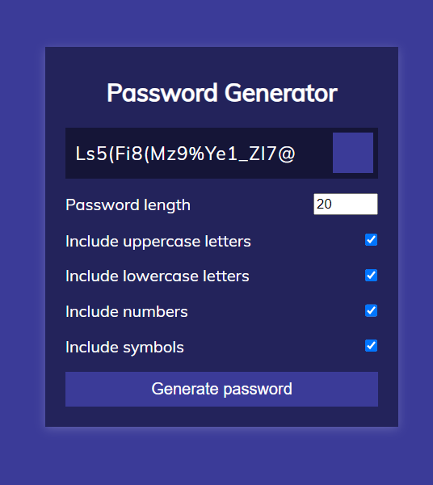

# Random Password Generator

A simple web-based random password generator project using HTML, CSS, and JavaScript.

## Table of Contents

- [Demo](#demo)
- [Features](#features)

## Demo

## Features

- Generates random passwords with customizable options.
- Responsive design for a seamless user experience on various devices.
- Easy to use and integrate into other projects.

### Prerequisites

- Web browser (Chrome, Firefox, Safari, etc.)

